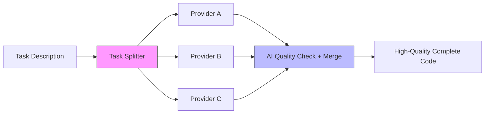

[English](./README.md) | [简体中文](./README.zh-CN.md)

# Qidi Agent

> **Free AI models orchestrate to write code that rivals top-tier LLMs — at zero cost.**

<p align="center">
  
</p>

<p align="center">
  
  
  
  
</p>

<p align="center">
  <a href="#quick-start">🚀 Quick Start</a> ·
  <a href="./docs/BENCHMARK.md">📊 Benchmark</a> ·
  <a href="./README.zh-CN.md">简体中文</a> ·
  <a href="./CONTRIBUTING.md">🤝 Contributing</a>
</p>

---

**Qidi** is an AI programming orchestration engine: it automatically splits complex tasks, distributes them to multiple **free** AI programming tools for parallel execution, and then merges the results through AI quality checking and intelligent merging to produce complete, high-quality code.

**Core Idea**: Individual free models have limited capabilities, but when multiple models each tackle what they're best at—through orchestration, quality checking, and merging—the final output quality can rival the top 10 models in the world **without paying their expensive API fees**.

## See It In Action

<p align="center">
  
</p>

<p align="center">
  <em>Output that actually runs 👇</em><br>
  
</p>

---

## How It Works



| Mode | Who Splits | Who Writes Code | Who Checks Quality | Who Merges | Cost |
|------|-----------|-----------------|-------------------|------------|------|
| 🔒 **Privacy Mode** | Local Ollama | Cloud tools (each gets a fragment) | Local Ollama | Local contract assembly | Zero |
| 🔀 **Multi-Model Mode** | Cloud models | Multiple providers in parallel | AI + Compilation | AI intelligent merge | Zero |
| ✨ **Quality Mode** | Cloud models | Cloud tools (matched by capability) | Cloud AI | AI intelligent merge | Minimal API |

---

## Quick Start

```bash
npm install
npx qidi scan                                   # Auto-scan local AI tools
npx qidi run "Write a Python web server" -m privacy   # Privacy mode
npx qidi run "Build a snake game" -m quality         # High-quality mode
npx qidi web                                           # Web management UI
```

---

## Core Features

### 🔒 Privacy Mode — Sensitive Code Never Leaves Local

Task splitting and quality checking are done locally with Ollama. Cloud AI tools only receive **fragmented function signatures** (`function processPayment(orderId)`), never the complete business logic. Perfect for compliance-sensitive scenarios.

### 🚀 Multi-Provider Parallelism

Distribute tasks across multiple AI tools simultaneously:

```bash
qidi multi -t "Build a frontend page" -m parallel    # Parallel dispatch
qidi multi -t "Task" -m sequential                  # Sequential dispatch
qidi multi -t "Task" -m select                      # Select best result
qidi multi -t "Task" -m cascade                     # Cascade (feed result to next)
qidi multi -t "Task" -m merge                       # Merge all outputs
```

### 🧪 Three-Layer Quality Checking

1. **Compilation Check**: Verify code compiles/runs
2. **Static Analysis**: Lint, security scanning
3. **AI Scoring**: Local/remote AI evaluates quality

### 🧩 Contract-Based Assembly

In privacy mode, code fragments are assembled locally based on function contracts, ensuring sensitive logic never leaves your machine.

---

## CLI Commands

```bash
qidi run   "Write a Python crawler"              # Single task: scan + dispatch + merge
qidi multi "Implement a frontend page" -m parallel  # Multi-agent parallel (7 modes)
qidi scan                                           # Scan local AI programming tools
qidi connect <tool>                                 # Connect a specific tool
qidi agents --check                                 # Check agent status
qidi web                                            # Start web management interface
qidi version                                        # View version
qidi logs                                           # View logs
```

---

## Supported Tools

**LLM Providers** (splitting/quality/merging): Ollama, OpenAI, Anthropic Claude, DeepSeek, Groq, Zhipu GLM

**External Programming Tools** (code writing): Claude Code, Open Code, OpenClaw, Qoder, Hermes Agent, AtomCode, Mimo Code, Trae CN, WorkBuddy, KimiWork, ZCode

> Auto-scans locally installed tools. Easy to add custom adapters.

---

## Routing Strategies

| Strategy | Description |
|----------|-------------|
| `round_robin` | Round-robin distribution, each tool handles part of the task |
| `capability` | Intelligently match best tool by language/framework/complexity |
| `manual` | Precise control via routing table |
| `broadcast` | All tools execute (traditional mode) |

---

## Web UI

After starting, visit http://localhost:3000

| Page | Features |
|------|----------|
| Dashboard | System status overview |
| Programming Console | Launch tasks, select modes, view progress |
| Tool Management | Scan, connect, enable/disable tools |
| Model Management | Configure AI models, API keys |
| Smart Routing | Configure routing strategies, manual routing table |
| Token Statistics | Token usage statistics |
| Report Center | View reports, search, compare |
| Task Management | Task history |

---

## Project Structure

```
src/
├── core/         Core orchestration: TaskOrchestrator · TaskRouter · ContractAssembler · ExecutionModeManager
├── agents/       AI Agents: TaskSplitterAgent · QualityCheckerAgent · MergeEngine
├── adapters/     11 external tool adapters
├── providers/    LLM providers: OllamaProvider · OpenAIProvider · AnthropicProvider
├── cli/          Command-line entry
└── utils/        Utilities: cache · token counting · context compression · logging · versioning · experiment reports
```

---

## Configuration

Copy `.env.example` to `.env`:

```bash
OLLAMA_MODEL=qwen2.5:7b        # Local splitting/quality model
OLLAMA_MODEL_SMALL=qwen2.5:3b  # Local small model
OPENAI_API_KEY=sk-xxx           # OpenAI (quality mode)
ANTHROPIC_API_KEY=sk-ant-xxx    # Claude (quality mode)
DEEPSEEK_API_KEY=sk-xxx         # DeepSeek (quality mode)
```

Edit `config/agents.json` to configure models:

```json
{
  "defaultAgent": "ollama",
  "agents": {
    "ollama": {
      "enabled": true,
      "config": { "baseURL": "http://localhost:11434", "model": "qwen2.5:7b" }
    },
    "anthropic": {
      "enabled": false,
      "config": { "apiKey": "${ANTHROPIC_API_KEY}", "model": "claude-3-5-sonnet-20240620" }
    },
    "deepseek": {
      "enabled": false,
      "config": { "apiKey": "${DEEPSEEK_API_KEY}", "baseURL": "https://api.deepseek.com/v1" }
    }
  }
}
```

---

## Privacy Protection

1. **Splitting happens locally**: Task decomposition logic runs entirely locally. Original requirements never leave your machine.
2. **Tools get fragments only**: Each cloud tool receives only its module's function signature, never seeing other modules.
3. **Optional local quality check**: Privacy mode uses local Ollama for scoring—code never leaves your computer.
4. **Assembly happens locally**: Code fragments are assembled locally after collection.

---

## Use Cases

| Scenario | Privacy Mode | Quality Mode |
|----------|-------------|-------------|
| Privacy-sensitive projects (code can't leave premises) | ⭐⭐⭐⭐⭐ | ⭐ |
| Complex multi-module projects | ⭐⭐⭐⭐ | ⭐⭐⭐⭐⭐ |
| Code review / quality improvement | ⭐⭐⭐ | ⭐⭐⭐⭐⭐ |
| Simple scripts / single files | ⭐⭐⭐⭐ | ⭐⭐ |
| Algorithm competitions (multi-model voting) | ⭐⭐⭐ | ⭐⭐⭐⭐ |

---

## Hardware Requirements

| Spec | Minimum | Recommended |
|------|---------|-------------|
| RAM | 8GB | 32GB+ |
| VRAM | 4GB | 12GB+ |
| Storage | Any | SSD |

> 💡 Works on low-end hardware too—all features tested on 16GB RAM + 6GB VRAM.

---

## Testing

```bash
npm test      # 53 smoke tests, 100% passing
```

---

## Roadmap

- [x] Task splitting + interface contracts
- [x] Multi-tool parallel dispatch (7 modes)
- [x] Auto-scan local AI tools
- [x] Three-layer quality check (compile + scan + AI scoring)
- [x] AI multi-path code merging
- [x] Experiment report system
- [x] Web management interface
- [x] Two execution modes (privacy/quality)
- [x] Anthropic Claude Provider
- [x] Contract assembly engine
- [x] Version management and logging
- [x] Multi-provider mode
- [x] WorkBuddy/KimiWork/ZCode adapters
- [ ] Recursive splitting (decompose large tasks)
- [ ] Streaming output + WebSocket
- [ ] MCP protocol support
- [ ] Plugin system
- [ ] Team collaboration edition

---

## Contributing

We welcome issues and PRs.

```bash
# Development
npm install
npm test           # Smoke tests
npm run web        # Start web UI

# Add new tool adapter
# 1. Create src/adapters/YourToolAdapter.js
# 2. Extend BaseToolAdapter
# 3. Implement detect() / connect() / execute()
# 4. Register in src/adapters/index.js
```

---

## ⚠️ Legal Notice

This tool calls third-party AI programming tools (Claude Code, Qoder, OpenCode, etc.) for code generation.

**Terms of Use**:
- Users are solely responsible for code generated by this tool
- Please comply with each tool's terms of service and EULA
- This project is not liable for any legal issues arising from use

**User Confirmation Mechanism**:
- Tool scanning: Each tool requires user confirmation before enabling
- Task execution: Shows list of tools to be used, executes after user confirmation
- Use `--auto-confirm` flag to skip confirmation (automated mode)

---

## License

MIT © 2026 Qidi AI

---

<p align="center">
  <i>Free model orchestration → top-tier code quality. Sensitive code → never leaves local.</i>
</p>